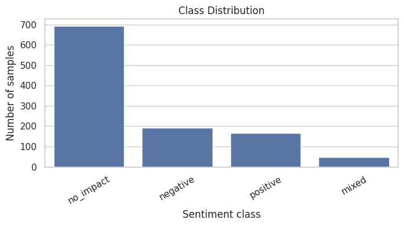
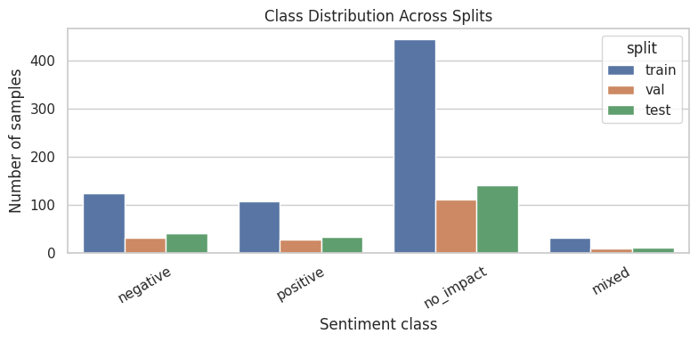
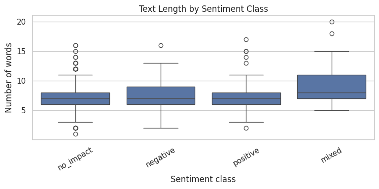
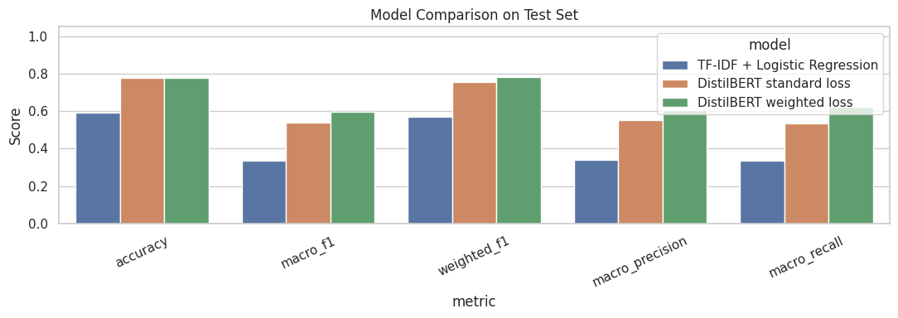
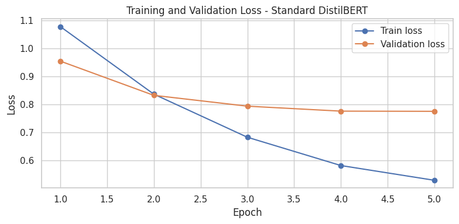
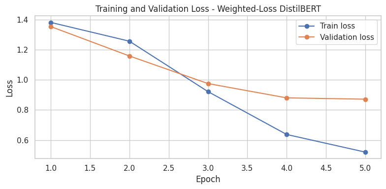
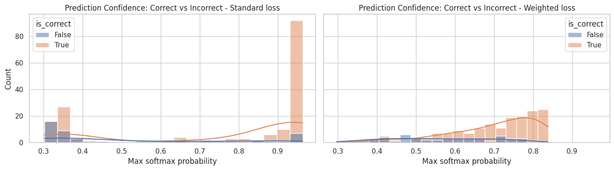

# Poem Sentiment Classification with DistilBERT

This project studies sentiment classification on short poem lines using a notebook-first NLP pipeline. The goal is not only to train a Transformer, but also to understand why this task is difficult: the dataset is strongly imbalanced, the labels can be subtle, and confidence scores do not behave the same way depending on the training loss.

The repository currently contains one main notebook:

```text
poem_sentiment_analysis_with_transformer.ipynb
```

The notebook compares three models:

1. **TF-IDF + Logistic Regression** as a classical baseline.
2. **DistilBERT with standard cross-entropy loss**.
3. **DistilBERT with class-weighted cross-entropy loss** to better handle class imbalance.

## Dataset and Main Challenge

The project uses the Hugging Face `poem_sentiment` dataset. Each poem line is classified into one of four labels:

<table align="center">
  <tr>
    <th>Label</th>
    <th>Meaning</th>
  </tr>
  <tr>
    <td><code>negative</code></td>
    <td>Negative emotional impact</td>
  </tr>
  <tr>
    <td><code>positive</code></td>
    <td>Positive emotional impact</td>
  </tr>
  <tr>
    <td><code>no_impact</code></td>
    <td>Neutral or no clear emotional impact</td>
  </tr>
  <tr>
    <td><code>mixed</code></td>
    <td>Mixed emotional signal</td>
  </tr>
</table>

The first important point is that the dataset is **not balanced**. The `no_impact` class dominates the dataset, while `mixed` is very rare. This makes the task difficult even before modeling: a classifier can obtain a decent accuracy by favoring the majority class, but that does not mean it handles minority classes well.

<p align="center">
  
</p>
<p align="center"><em>Figure 1 — The dataset is dominated by the `no_impact` class.</em></p>

To keep the comparison fair, the notebook builds a new stratified train / validation / test split. This preserves similar class proportions across the three splits.

<table align="center">
  <tr>
    <th>Split</th>
    <th>Samples</th>
  </tr>
  <tr>
    <td>Train</td>
    <td align="right">704</td>
  </tr>
  <tr>
    <td>Validation</td>
    <td align="right">176</td>
  </tr>
  <tr>
    <td>Test</td>
    <td align="right">221</td>
  </tr>
  <tr>
    <td><strong>Total</strong></td>
    <td align="right"><strong>1,101</strong></td>
  </tr>
</table>

<p align="center">
  
</p>
<p align="center"><em>Figure 2 — Stratification keeps class proportions stable across splits.</em></p>

Because of this imbalance, the notebook reports not only accuracy, but also **Macro-F1**, **Macro Precision**, and **Macro Recall**. These metrics are more informative here because they give more visibility to the minority classes.

## Exploratory Insight: Text Length and Sentiment

A small but interesting observation appears in the exploratory analysis: poem lines labelled as `mixed` and `negative` tend to be longer on average than `positive` and `no_impact` lines.

<p align="center">
  
</p>
<p align="center"><em>Figure 3 — Text length distribution and word count differences between classes.</em></p>

One possible interpretation is intuitive: when something feels negative, people may need more words to describe the discomfort, conflict, or emotional tension. When the sentiment is mixed, the text may become even longer because it has to express uncertainty or contrast. In comparison, positive or neutral lines can often be shorter and more direct.

This is not used as a direct rule for prediction, but it helps explain why the labels are not equally easy to learn.

## Modeling Approach

### Baseline: TF-IDF + Logistic Regression

The baseline uses a classical scikit-learn pipeline:

- TF-IDF vectorization;
- unigrams and bigrams;
- a maximum of 5,000 features;
- Logistic Regression;
- balanced class weights.

This baseline is useful because it gives a simple reference point before using a Transformer.

### Transformer: DistilBERT with Standard Loss

The first Transformer model fine-tunes `distilbert-base-uncased` using the default cross-entropy loss. This is the standard setup for multi-class text classification.

### Transformer: DistilBERT with Weighted Loss

The second Transformer uses the same architecture and the same training setup, but changes the loss function. Because the dataset is imbalanced, the notebook computes class weights from the training split and uses them inside a custom weighted cross-entropy loss.

<table align="center">
  <tr>
    <th>Label</th>
    <th align="right">Train Count</th>
    <th align="right">Class Weight</th>
  </tr>
  <tr>
    <td><code>negative</code></td>
    <td align="right">123</td>
    <td align="right">1.431</td>
  </tr>
  <tr>
    <td><code>positive</code></td>
    <td align="right">107</td>
    <td align="right">1.645</td>
  </tr>
  <tr>
    <td><code>no_impact</code></td>
    <td align="right">443</td>
    <td align="right">0.397</td>
  </tr>
  <tr>
    <td><code>mixed</code></td>
    <td align="right">31</td>
    <td align="right">5.677</td>
  </tr>
</table>

The logic is simple: mistakes on rare classes should matter more than mistakes on the majority class. In this dataset, this is especially important for `mixed`, which has very few examples.

## Results: Baseline vs Transformer Models

The Transformer models clearly outperform the TF-IDF baseline. This is one of the central results of the notebook: contextual representations from DistilBERT are much more effective than sparse TF-IDF features for this task.

<p align="center">
  
</p>
<p align="center"><em>Figure 4 — DistilBERT improves strongly over the TF-IDF baseline.</em></p>

<table align="center">
  <tr>
    <th>Model</th>
    <th align="right">Accuracy</th>
    <th align="right">Macro-F1</th>
    <th align="right">Weighted-F1</th>
    <th align="right">Macro Precision</th>
    <th align="right">Macro Recall</th>
  </tr>
  <tr>
    <td>TF-IDF + Logistic Regression</td>
    <td align="right">0.593</td>
    <td align="right">0.337</td>
    <td align="right">0.571</td>
    <td align="right">0.341</td>
    <td align="right">0.336</td>
  </tr>
  <tr>
    <td>DistilBERT, standard loss</td>
    <td align="right">0.778</td>
    <td align="right">0.538</td>
    <td align="right">0.757</td>
    <td align="right">0.551</td>
    <td align="right">0.534</td>
  </tr>
  <tr>
    <td>DistilBERT, weighted loss</td>
    <td align="right">0.778</td>
    <td align="right">0.596</td>
    <td align="right">0.780</td>
    <td align="right">0.605</td>
    <td align="right">0.621</td>
  </tr>
</table>

The weighted-loss Transformer keeps the same accuracy as the standard Transformer, but improves the metrics that matter most in an imbalanced setting:

<table align="center">
  <tr>
    <th>Metric</th>
    <th align="right">Standard Loss</th>
    <th align="right">Weighted Loss</th>
    <th align="right">Difference</th>
  </tr>
  <tr>
    <td>Accuracy</td>
    <td align="right">0.778</td>
    <td align="right">0.778</td>
    <td align="right">+0.000</td>
  </tr>
  <tr>
    <td>Macro-F1</td>
    <td align="right">0.538</td>
    <td align="right">0.596</td>
    <td align="right">+0.059</td>
  </tr>
  <tr>
    <td>Weighted-F1</td>
    <td align="right">0.757</td>
    <td align="right">0.780</td>
    <td align="right">+0.023</td>
  </tr>
  <tr>
    <td>Macro Precision</td>
    <td align="right">0.551</td>
    <td align="right">0.605</td>
    <td align="right">+0.054</td>
  </tr>
  <tr>
    <td>Macro Recall</td>
    <td align="right">0.534</td>
    <td align="right">0.621</td>
    <td align="right">+0.087</td>
  </tr>
</table>

This means the weighted loss does not simply increase the number of correct predictions overall. Instead, it makes the model more balanced across classes, which is more relevant for this dataset.

## Training Behavior

The loss curves also support the choice of the weighted-loss model. With the standard loss, the model learns the dominant structure of the dataset, but the training behavior is more affected by the majority class. The weighted-loss model gives more importance to minority classes and obtains stronger validation behavior in terms of imbalance-sensitive metrics.

<table align="center">
  <tr>
    <td align="center" width="50%">
      
      <br>
      <em>Standard cross-entropy loss</em>
    </td>
    <td align="center" width="50%">
      
      <br>
      <em>Class-weighted cross-entropy loss</em>
    </td>
  </tr>
</table>

The weighted-loss run performs better on the final metrics, and the loss curves suggest that overfitting appears slightly later than with the standard-loss run. This makes sense for an imbalanced dataset: by forcing the model to pay more attention to rare labels, the weighted loss can delay the moment where the model becomes too specialized around the dominant `no_impact` class.

On the validation split, the best Macro-F1 is also higher for the weighted-loss model:

<table align="center">
  <tr>
    <th>Model</th>
    <th align="right">Best Validation Epoch</th>
    <th align="right">Best Validation Macro-F1</th>
    <th align="right">Best Validation Accuracy</th>
    <th align="right">Best Validation Weighted-F1</th>
  </tr>
  <tr>
    <td>DistilBERT, standard loss</td>
    <td align="right">5</td>
    <td align="right">0.482</td>
    <td align="right">0.727</td>
    <td align="right">0.711</td>
  </tr>
  <tr>
    <td>DistilBERT, weighted loss</td>
    <td align="right">4</td>
    <td align="right">0.599</td>
    <td align="right">0.750</td>
    <td align="right">0.749</td>
  </tr>
</table>

## Error Analysis

The error analysis is important because the two Transformer models have the same test accuracy and the same number of test errors, but they do not behave in the same way.

Both models make **49 errors out of 221 test examples**, corresponding to an error rate of about **22.2%**. However, the weighted-loss model has a better Macro-F1 score, which means the errors are distributed in a more useful way across the classes.

<p align="center">
  
</p>
<p align="center"><em>Figure 5 — Confidence distribution for correct and incorrect predictions.</em></p>

The standard-loss model shows a more compact error pattern. Many wrong predictions are concentrated at high confidence, which means that a high confidence threshold is needed before trusting the prediction. Even then, the model can still produce inconsistencies: some predictions that were already uncertain can become hard to interpret because the confidence distribution is less gradual.

The weighted-loss model produces a more spread-out error profile. The number of correct predictions starts increasing around a confidence of 0.5, while lower-confidence predictions are less reliable. This behavior is more coherent: confidence is more aligned with prediction quality, which makes the model easier to interpret and safer to use with a threshold.

In other words, the weighted-loss model is not only better in terms of metrics. Its confidence behavior is also more useful for downstream decision-making.

## Key Takeaways

- The dataset is imbalanced, with a strong majority of `no_impact` examples, so accuracy alone is not enough.
- Poem lines labelled `mixed` and `negative` tend to be longer, which may reflect the need to express conflict, hesitation, or negative emotion with more detail.
- DistilBERT clearly outperforms the TF-IDF + Logistic Regression baseline.
- The weighted-loss DistilBERT model performs better than the standard-loss DistilBERT on Macro-F1, Macro Precision, Macro Recall, and Weighted-F1.
- Weighted loss is especially relevant here because the task contains rare classes, especially `mixed`.
- Error analysis shows that the weighted-loss model has a more coherent confidence distribution than the standard-loss model.

## How to Run

Open the notebook and run the cells from top to bottom.

The notebook can be run locally or in Google Colab. In Colab, the setup cell installs the required packages:

```bash
pip install -q datasets transformers evaluate accelerate scikit-learn matplotlib seaborn pandas torch
```

Main dependencies:

```text
datasets
transformers
evaluate
accelerate
scikit-learn
matplotlib
seaborn
pandas
torch
```

The notebook saves the trained models and tokenizer locally after training:

```text
../models/final-distilbert-poem-sentiment-standard
../models/final-distilbert-poem-sentiment-weighted-loss
../models/final-distilbert-poem-sentiment-best
```

These generated model folders are not required to be present in the repository by default.

## Repository Structure

```text
.
├── poem_sentiment_analysis_with_transformer.ipynb
├── figures/
│   ├── class_distribution.png
│   ├── class_distribution_across_splits.png
│   ├── word_distribution.png
│   ├── model_metric_comparison.png
│   ├── loss_standard.png
│   ├── loss_weighted.png
│   └── error_analysis_standard_vs_weighted.png
└── README.md
```
